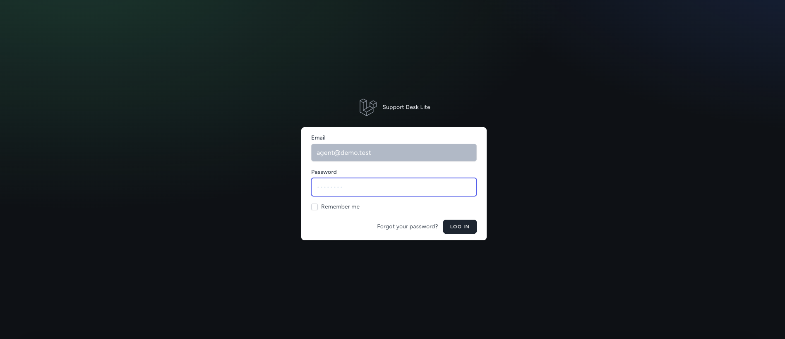
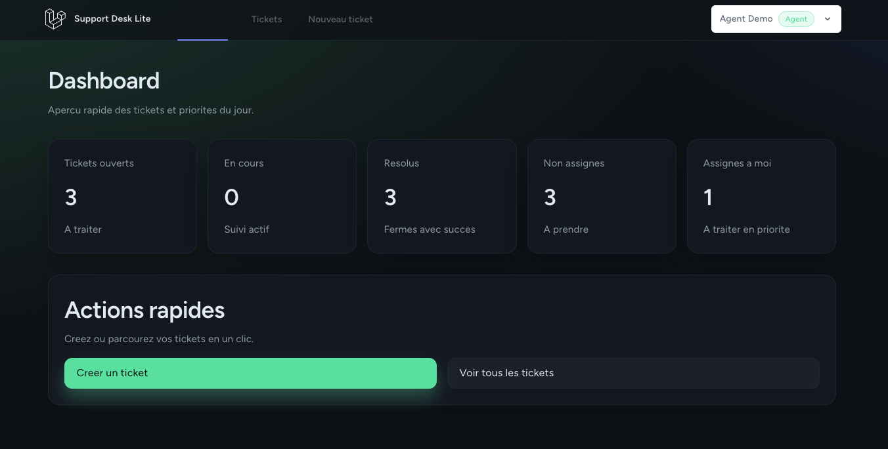
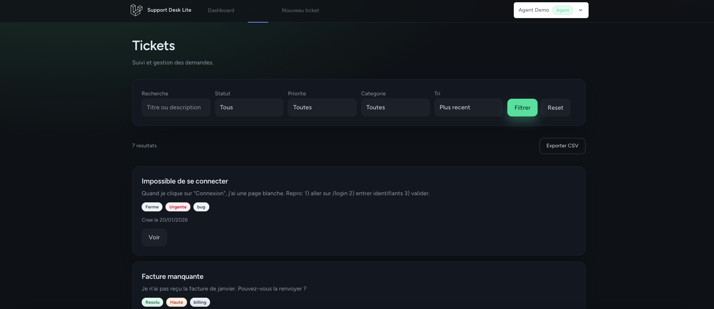
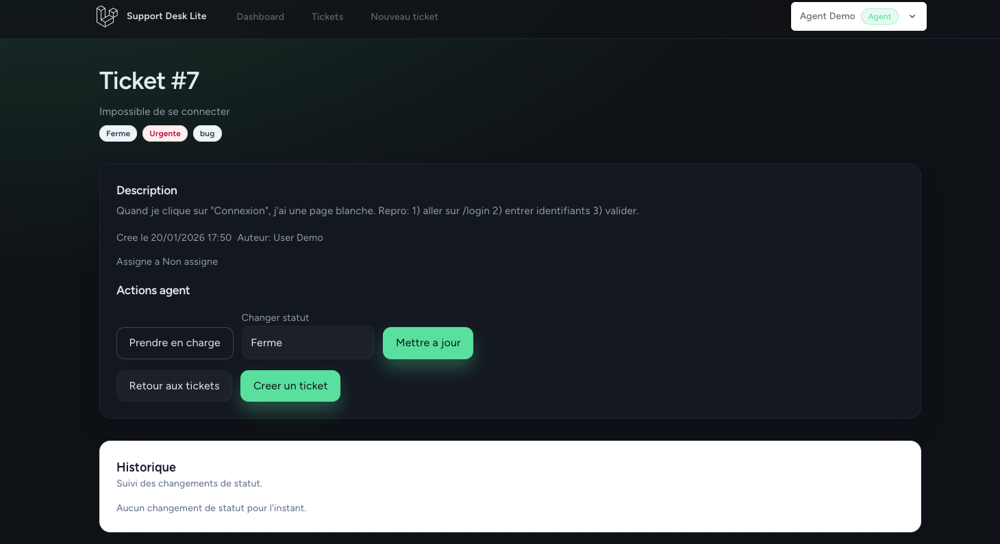
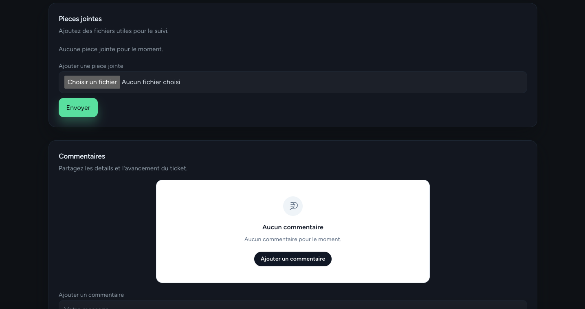
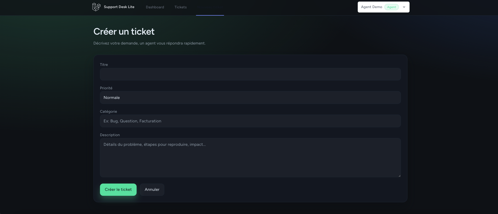

# Support Desk Lite
Outil de gestion de tickets multi-roles (user/agent/admin) avec workflow clair, commentaires, notifications et export CSV.
Focus sur une UX propre, une securite basique solide, et un socle testable.

## Stack technique
- Laravel 11
- Breeze (auth + profile)
- Tailwind CSS
- Alpine.js
- SQLite
- Vite

## Fonctionnalites principales
- Creation et suivi de tickets (statuts, priorites, categories)
- Workflow agent: prise en charge, changement de statut, timeline
- Commentaires avec sanitization anti-XSS
- Notifications email (nouveau commentaire) avec preferences
- Export CSV des tickets avec filtres
- Page admin Agents (liste + charge)
- Toasts UI centralises

## Roles et permissions
- User: cree et suit ses tickets, commente ses tickets
- Agent: voit les tickets, assigne, change statut, export CSV
- Admin: acces aux vues admin (ex: Agents)

## Installation locale
### Prerequis
- PHP 8.2+
- Composer
- Node.js + npm
- SQLite

### Installation
```bash
composer install
npm install
cp .env.example .env
php artisan key:generate
touch database/database.sqlite
```

Configurer SQLite dans `.env`:
```
DB_CONNECTION=sqlite
DB_DATABASE=/chemin/absolu/vers/database/database.sqlite
```

### Base de donnees
```bash
php artisan migrate --seed
```

### Lancement
```bash
php artisan serve
npm run dev
```

### Stockage (pieces jointes)
```bash
php artisan storage:link
```

## Comptes de demo
Seeder inclus via `DatabaseSeeder`:
- agent@demo.test / password
- user@demo.test / password

Pas de compte admin par defaut. Creation rapide via Tinker:
```bash
php artisan tinker
App\Models\User::factory()->state([
  'name' => 'Admin Demo',
  'email' => 'admin@demo.test',
  'role' => 'admin',
  'password' => bcrypt('password'),
])->create();
```

## Tests
```bash
php artisan test
```

## Structure du projet
- app/Http/Controllers: logique des actions
- app/Services: services metier (assignment, requetes tickets)
- app/Notifications: emails
- app/Policies: autorisations
- resources/views: pages et composants Blade
- resources/js: UI (toasts)
- database/migrations, seeders
- tests/Feature

## Securite et UX
- Rate limit sur creation de tickets (anti-spam)
- Commentaires nettoyes (strip_tags + normalisation)
- Policies + middleware admin
- Toasts UI centralises
- Badges FR normalises (status/priorite)
- Historique des statuts (timeline)
- Export CSV controle (agent/admin)

## Roadmap (courte)
- Participants du ticket + notifications avancees
- SLA et priorisation automatique
- Filtres avances + vue analytics
- Mode multi-projets

## Captures d'ecran
Apercu rapide des ecrans principaux.
- 
- 
- 
- 
- 
- 

## Troubleshooting
- SQLite: verifier permissions sur `database/database.sqlite`
- Mails: utiliser `MAIL_MAILER=log` et verifier `storage/logs/laravel.log`
- Vite: relancer `npm run dev` si les styles ne chargent pas
- Cache: `php artisan config:clear` / `php artisan cache:clear`

## Conventions Git / branches
- Base: `develop`
- Branches feature: `feature/ma-feature`
- PR courtes et scope clair
